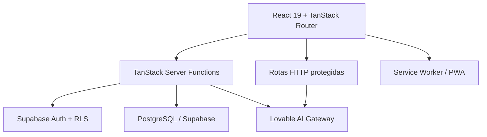

# Arquitetura do Wise Money

Este documento apresenta as decisões técnicas que ajudam uma pessoa revisora a entender o projeto
sem precisar percorrer todos os arquivos.

## Visão geral

## Camadas

| Camada               | Responsabilidade                                        | Localização                   |
| -------------------- | ------------------------------------------------------- | ----------------------------- |
| Rotas e páginas      | Navegação, composição de telas e carregamento de dados  | `src/routes`                  |
| Componentes          | Interface reutilizável, acessibilidade e interação      | `src/components`              |
| Casos de uso         | Operações financeiras autenticadas                      | `src/lib/*.functions.ts`      |
| Serviços de servidor | IA, mercado, relatórios e regras que não vão ao cliente | `src/lib/*.server.ts`         |
| Autenticação         | Sessão do cliente, middleware e validação de rotas HTTP | `src/integrations/supabase`   |
| Persistência         | Schema, RLS, índices e migrações                        | `drizzle/migrations`          |
| Qualidade            | CI, testes unitários, E2E e regressão visual            | `.github`, `scripts`, `tests` |

## Fluxo de autenticação

1. O usuário entra pelo Supabase Auth ou OAuth do Google.
2. As server functions recebem o token e o validam no middleware `requireSupabaseAuth`.
3. As consultas usam o cliente autenticado, mantendo as políticas de RLS ativas.
4. Operações administrativas usam a `service role` somente no servidor.
5. A rota de TTS também exige token válido e aplica limite de solicitações por usuário.

## Limites de confiança

- O navegador é considerado um ambiente não confiável.
- Chaves públicas do Supabase podem existir no cliente; chaves secretas ficam somente na hospedagem.
- Identificadores enviados pelo navegador são validados e as consultas também filtram `user_id`.
- Respostas de integrações externas são normalizadas antes de chegar à interface.
- O rate limit em memória da rota TTS é uma proteção de primeira camada; uma implantação de grande
  escala deve substituí-lo por armazenamento distribuído.

## Decisões e débitos técnicos conhecidos

- As regras de alertas e relatório do dashboard já estão isoladas em funções puras, e suas seções
  visuais maiores foram extraídas para componentes próprios. A rota principal ainda pode ser
  subdividida progressivamente conforme novos recursos forem adicionados.
- O fluxo de comprovantes já possui regras de revisão testáveis, mas seus painéis visuais e estados
  ainda podem ser separados em uma evolução futura.
- Alguns componentes de UI gerados exportam componentes e utilitários juntos, produzindo avisos de
  Fast Refresh sem impedir o build.
- A migração do Recharts 2 para a versão principal atual deve ser feita separadamente, acompanhada
  de regressão visual.
- O conjunto de testes cobre formatação, revisão de comprovantes, alertas, relatórios e renderização
  progressiva. Fluxos E2E autenticados devem receber cobertura progressiva.
